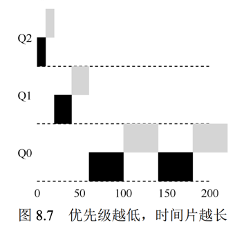

### 一、虚拟化概念

以最基本的计算机资源 CPU 为例，
假设一个计算机只有一个 CPU（尽管现代计算机一般拥有 2 个、4 个或者更多 CPU），虚拟
化要做的就是将这个 CPU 虚拟成多个虚拟 CPU 并分给每一个进程使用，因此，每个应用都
以为自己在独占 CPU，但实际上只有一个 CPU。这样操作系统就创造了美丽的假象——它
虚拟化了 CPU。

### 二、进程
    系统提供的基本的抽象—— 进程。进程的非正式定义非常简单：进程就
    是运行中的程序。程序本身是没有生命周期的，它只是存在磁盘上面的一些指令（也可能
    是一些静态数据）。是操作系统让这些字节运行起来，让程序发挥作用。

#### 时分共享，空分共享
   * 时分共享（time sharing）就是分享时间片；计算机的CPU，网络等资源逐个分配给程序，然后分配给别的程序；
   * 空分共享 ：空间共享，例如：磁盘空间分配给某个用户，只要这个文件没有被清理，就没法分配给别的人，但整个磁盘可以分配给不同用户；

#### 进程的机器状态（machine state）

   * 内存，运行的指令存在于内存中,数据的读写也在内存中，进程可以访问的内存空间称为--地址空间
   * 寄存器 ：标识一下状态，指令寄存器，栈寄存器
   * I/O设备 ：文件列表等等；

#### 进程细节

1. 进程API
* 创建（create）：操作系统必须包含一些创建新进程的方法。在 shell 中键入命令
  或双击应用程序图标时，会调用操作系统来创建新进程，运行指定的程序。
* 销毁（destroy）：由于存在创建进程的接口，因此系统还提供了一个强制销毁进
  程的接口。当然，很多进程会在运行完成后自行退出。但是，如果它们不退出，
  用户可能希望终止它们，因此停止失控进程的接口非常有用。
* 等待（wait）：有时等待进程停止运行是有用的，因此经常提供某种等待接口。
* 其他控制（miscellaneous control）：除了杀死或等待进程外，有时还可能有其他
  控制。例如，大多数操作系统提供某种方法来暂停进程（停止运行一段时间），
  然后恢复（继续运行).
  *状态（statu）：通常也有一些接口可以获得有关进程的状态信息，例如运行了多
  长时间，或者处于什么状态。

2. 进程创建
   程序先从磁盘中，加载到内存（可以懒加载，需要再加载），为程序运行栈分配内存，可能分配堆内存
   为每个进程打开三个标准文件描述符，标准输入，输出和错误；
3. 状态
  * 运行：程序正在处理器上运行，执行相应的指令
  * 就绪：程序准备好运行，但是由于某些原因没有运行
  * 阻塞：程序某种操作等待其他操作结束，例如 I/O操作；

#### 进程的api操作

​	

```c
1. 可以使用man命令查看一些函数细节；例如：man fork 可以看fork函数的操作；阅读文档j可以往下翻页 q是退出文档。

2. fork（void）函数；
  #include <unistd.h>
	创建一个新的子进程，不需要参数;
	返回值：子进程中返回0，父进程中返回子进程的process id；
	注意点：新创建的子进程会在fork函数调用的下一行开始执行，掠过fork之前的代码，会有自己的地址空间？？？
	父进程和子进程的代码执行顺序无法确定，除非父进程调用wait函数，子进程结束后执行父进程wait后面的代码；
	
3. wait()
       #include <sys/types.h>
       #include <sys/wait.h>
       pid_t wait(int *wstatus);
       pid_t waitpid(pid_t pid, int *wstatus, int options);
       作用：挂起调用api的线程，直到该线程的子线程结束；
       返回值：wait函数 成功子线程的pid，失败返回-1
       wstatus 是线程执行状态，在外面定义可以接受出来；传入NULL是不需要接收；

4. exec()函数，是一个家族，但是没有exec，
 			#include <unistd.h>
			int execvp(const char *file, char *const argv[]);
			作用：执行别的文件中的程序
			参数： 第一个参数是执行文件的名称（可执行文件），后面是文件需要的参数，参数最后以NULL结尾；
			返回值：-1 失败
			
			函数分两组
			execl()、execle()、execlp()、
			execv()、execvp()和 execvP()
			带“l”的是指参数以list，单个写入
			带“V”的是参数以数组写入
			带“p“指的是不需要path，第一个参数执行的文件名；
			带”e“指的是environments，环境，有第三种类型的参数--环境变量；
			 
	   int execl(const char *pathname, const char *arg, .../* (char  *) NULL */);
       int execlp(const char *file, const char *arg, ... /* (char  *) NULL */);
       int execle(const char *pathname, const char *arg, .../*, (char *) NULL,  *const envp[] */);
       
       int execv(const char *pathname, char *const argv[]);
       int execvp(const char *file, char *const argv[]);
       int execvpe(const char *file, char *const argv[], char *const envp[]);
```


#### 机制：受限直接执行

虚拟化机制的两个问题：

​		1：程序运行的更快;肯定越快越好，最快的就是直接运行程序，独享CPU；

​		2：操作系统要能接收到控制权，为了实现桃子分配给多个人；但是CPU每次只能让一个
程序使用，如果程序在运行那么就操作系统就没法运行，操作系统不运行如何切换另一个程序运行呢？

操作系统直接执行的过程：操作系统只能等程序return的时候接手控制权


受限直接运行：某些操作不允许进程去做，例如IO；只有调用系统接口，让系统去执行；系统执行是内核模式，普通用户是用户模式；一次IO就会从用户模式--》内核模式--》用户模式；

`两种模式的区别是执行指令的等级，一些特殊指令只能内核模式执行`


进程间的切换：切换是控制权的争夺，两种方式

* 协同方式：等待程序调用系统，转移控制权；没有主动性，

* 非协作方式：操作系统自己控制 -- 时钟中断系统，定期把控制权转移到操作系统；

  

  切换进程就是伴随着上下文切换，就是保存执行的状态方便恢复之后继续执行；

  

#### 进程调度：介绍

一个完全可操作调度需要的条件

1. 我们对操作系统中运行的进程（有时也叫工作任务）做出如下的假设：

   1. 每一个工作运行相同的时间。
   2. 所有的工作同时到达。 
   3. 一旦开始，每个工作保持运行直到完成。 
   4. 所有的工作只是用 CPU（即它们不执行 IO 操作）。
   5. 每个工作的运行时间是已知的。

2. 衡量调度的指标

   1. 周转时间--就是任务停留在系统的时间

      $$ T 周转时间= T 完成时间−T 到达时间 $$

      三个任务 A,B和C各需要10s 平均周转时间就是 （10+20+30）/3 = 20s

   2. 响应时间--任务提交到首次运行的时间

      ​	T 响应时间= T 首次运行−T 到达时间

3. 调度策略变化历程

   1. 先进先出（FIFO）

      1. 优点：简单，实现容易
      2. 缺点：受护航效应影响，影响周转

   2. 最短任务优先（SJF）

      1. 优点：周转快
      2. 缺点：假设任务同时到达才成立，

   3. 最短时间完成优先（STCF）

      1. 抢占式调度，加快周转时间

   4. 轮状调度（RR）

      1. 可以大大降低响应时间，提升用户体验，但是周转时间会延长

      调度的基本思想，并开发了两类方法。第一类是运行最短的工作，从而优 化周转时间。第二类是交替运行所有工作，从而优化响应时间。但很难做到“鱼与熊掌兼 得”，这是系统中常见的、固有的折中。

#### 多级反馈队列：MLFQ

MLFQ 中有许多独立的队列（queue），每个队列有不同的优先级（priority level）。任何 时刻，一个工作只能存在于一个队列中。MLFQ 总是优先执行较高优先级的工作（即在较 高级队列中的工作）。 当然，每个队列中可能会有多个工作，因此具有同样的优先级。在这种情况下，我们 就对这些工作采用轮转调度。 因此，MLFQ 调度策略的关键在于如何设置优先级。MLFQ 没有为每个工作指定不变 的优先级，而是根据观察到的行为调整它的优先级。

工作类型分类

* 交互型工作：等待键盘输入比较多
* 计算密集型工作：大量使用cpu

至此，我们得到了 MLFQ 的两条基本规则。 

* 规则 1：如果 A 的优先级 > B 的优先级，运行 A（不运行 B）。 
* 规则 2：如果 A 的优先级 = B 的优先级，轮转运行
* 规则 3：工作进入系统时，放在最高优先级（最上层队列）。 
* 规则 4a：工作用完整个时间片后，降低其优先级（移入下一个队列）。 
* 规则 4b：如果工作在其时间片以内主动释放 CPU， 则优先级不变。
* 规则 4：一旦工作用完了其在某一层中的时间配额（无论中间主动放弃了多少次 CPU），就降低其优先级（移入低一级队列）。--- 防止cpu被恶意占用
* 规则 5：经过一段时间 S，就将系统中所有工作重新加入最高优先级队列。




算法的一个主要目标：如果不知道工作是短工作还是长工作，那么就在开始的时候假设其是短工作，并赋予最高优先级。如果确实是短 工作，则很快会执行完毕，否则将被慢慢移入低优先级队列，而这时该工作也被认为是长 工作了。通过这种方式，MLFQ 近似于 SJF。


#### 调度：比例份额

有时也称为公平份额（fair-share）调度程序。比例份额算法基于一个简单的想法：调 度程序的最终目标，是确保每个工作获得一定比例的 CPU 时间，而不是优化周转时间和响 应时间。

##### 彩票调度

A占有75个彩票，B占有25个彩票，比例为4:1；产生一个随机数，1-100，前25个就调用B后面就调用A；因为是随机在调用比较少的时候期望相差较大；

##### 彩票机制

`机制1`一种方式是利用彩票 货币（ticket currency）的概念。这种方式允许拥有一组彩票的用户以他们喜欢的某种货币， 将彩票分给自己的不同工作。之后操作系统再自动将这种货币兑换为正确的全局彩票。

例如：A 和用户 B 每人拥有 100 张彩票。用户 A 有两个工作 A1 和 A2，他以 自己的货币，给每个工作 500 张彩票（共 1000 张）。用户 B 只运行一个工作，给它 10 张彩 票（总共 10 张）。操作系统将进行兑换，将 A1 和 A2 拥有的 A 的货币 500 张，兑换成全局 货币 50 张。类似地，兑换给 B1 的 10 张彩票兑换成 100 张。然后会对全局彩票货币（共 200 张）举行抽奖，决定哪个工作运行。

隐藏的前提是每个用户使用CPU的权利相同，因此待处理的任务越多，彩票货币占有越少；

`机制2` 彩票转让，把自己拥有的彩票转让给另一个进程

`机制3` ：彩票通胀：利用通胀，一个进程可以临时提升或 降低自己拥有的彩票数量。当然在竞争环境中，进程之间互相不信任，这种机制就没什么 意义。一个贪婪的进程可能给自己非常多的彩票，从而接管机器

##### 步长调度

虽然随机方式 可以使得调度程序的实现简单（且大致正确），但偶尔并不能产生正确的比例，尤其在工作 运行时间很短的情况下；

> 步长调度也很简单。系统中的每个工作都有自己的步长，这个值与票数值成反比。在 上面的例子中，A、B、C 这 3 个工作的票数分别是 100、50 和 250，我们通过用一个大数 分别除以他们的票数来获得每个进程的步长。比如用 10000 除以这些票数值，得到了 3 个 进程的步长分别为 100、200 和 40。我们称这个值为每个进程的步长（stride）。每次进程运 行后，我们会让它的计数器 [称为行程（pass）值] 增加它的步长，记录它的总体进展。 之后，调度程序使用进程的步长及行程值来确定调度哪个进程。基本思路很简单：当 需要进行调度时，选择目前拥有最小行程值的进程，并且在运行之后将该进程的行程值增 加一个步长。

找到一个大的公约数，获取各个进程的步长，彩票数越多，步长越小，找到最小步长的进程执行，执行后增加一个步长数，直到不是最小行程，然后随机分配；

彩票调度有一个步长调度没有的优势——不需要全局状态；

