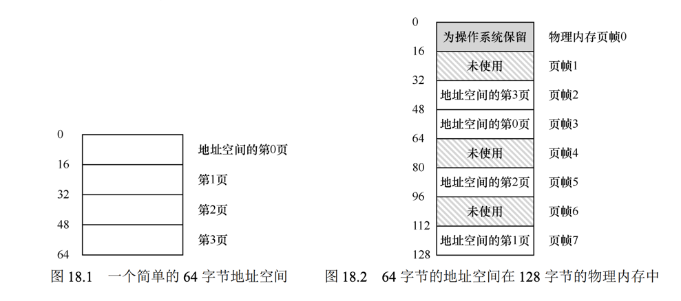
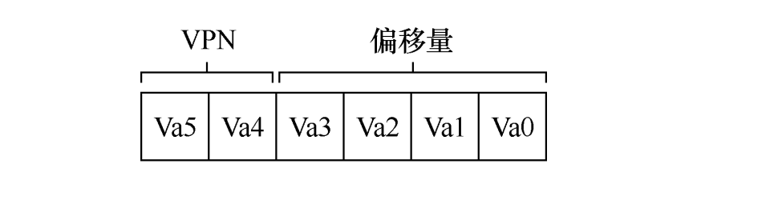
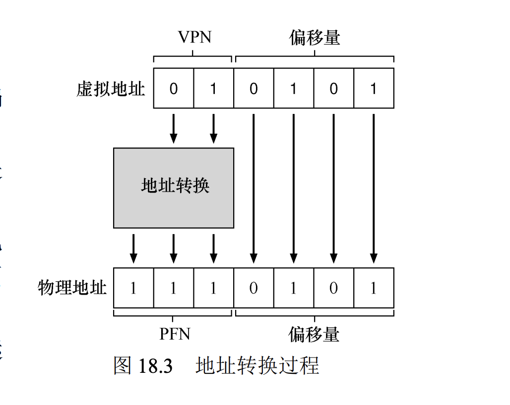
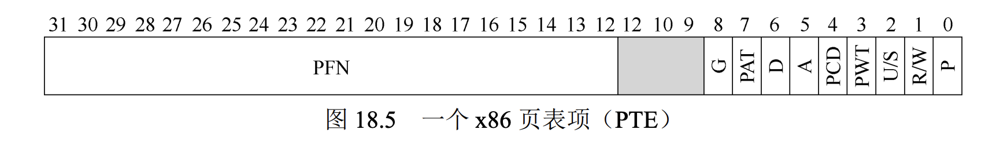

#### 抽象地址空间

虚拟地址的一大作用就是让进程觉得自己独占了整个磁盘空间，其实仅仅是系统让你看到的假象。

早期的进程是单个的占用整个空间，后面改为了多个，可以运行多任务，就需要实现内存的保护，隔离；

##### 为什么要有虚拟内存

​	还是为了方便使用，如果只运行一个程序那么不需要；如果内存加载一个程序，然后放回磁盘加载另一个也可以，但是太慢了；保证多个用户，多个程序运行，又不互相影响，只能统一管理内存；

#### 插叙：内存操作API

```c
申请内存和释放操作
    malloc
    free()
    realloc()
    
    gdb，valgrind
    调试工具和valgrind内存检测工具；
```

#### 机制：地址转换

> 我们利用了一种通用技术，有时被称为`基于硬件`的地址转换（hardware-based address translation），简称为地址转换（address translation）。它可以看成是受限直接执行这种一般方 法的补充。利用地址转换，硬件对`每次内存访问进行处理`（即指令获取、数据读取或写 入），将指令中的虚拟（virtual）地址转换为数据实际存储的物理（physical）地址。因此， 在`每次内存引用时，硬件都会进行地址转换`，将应用程序的内存引用重定位到内存中实际 的位置。

> 仅仅依靠硬件不足以实现虚拟内存，因为它只是提供了底层机制来提高效率。 操作系统必须在关键的位置介入，设置好硬件，以便完成正确的地址转换。

> 所有这些工作都是为了创造一种美丽的假象：每个程序都拥有私有的内存，那 里存放着它自己的代码和数据。虚拟现实的背后是丑陋的物理事实：`许多程序其实是在同 一时间共享着内存`，就像 CPU（或多个 CPU）在不同的程序间切换运行。


##### 动态重定位

每个 CPU 需要两个硬件寄存器：基址（base）寄存器和界限（bound）寄存 器，有时称为限制（limit）寄存器。这组基址和界限寄存器，让我们能够将地址空间放在物 理内存的任何位置，同时又能确保进程只能访问自己的地址空间

`physical address = virtual address + base`


base提供了偏移量，bound用来检查内存安全

context switch的时候也会进行这种切换


硬件支持

* 模式内核，用户转换
* MMU处理地址计算

#### 内存分段

##### 为什么要分段

更好的利用内存，减少内部碎片浪费；分段之后可以分开存储每个段

##### 确定地址段的方式

1. 使用标识符


1. 产生地址的方式


硬件还有其他方法来决定特定地址在哪个段。在隐式（implicit）方式中，硬件通过地 址产生的方式来确定段。例如，如果地址由程序计数器产生（即它是指令获取），那么地址 在代码段。如果基于栈或基址指针，它一定在栈段。其他地址则在堆段。


##### 支持共享

分段之后可以，让一些特定的段共享，例如代码段，但是必须要有硬件的支持，把响应的段标记为只读，进行保护才行；


##### 总结

 分段解决了一些问题，帮助我们实现了更高效的虚拟内存。不只是动态重定位，通过 避免地址空间的逻辑段之间的大量潜在的内存浪费，分段能更好地支持稀疏地址空间。它 还很快，因为分段要求的算法很容易，很适合硬件完成，地址转换的开销极小。分段还有 一个附加的好处：代码共享。如果代码放在独立的段中，这样的段就可能被多个运行的程 序共享。 但我们已经知道，在内存中分配不同大小的段会导致一些问题，我们希望克服。首先， 是我们上面讨论的外部碎片。由于段的大小不同，空闲内存被割裂成各种奇怪的大小，因 此满足内存分配请求可能会很难。用  


#### 空闲地址空间管理


##### 底层机制

* 分割与合并 	申请空间会分割给你，free会把相邻空闲空间进行合并
* 

* malloc分配空间，不是单纯的空间，还会分配一部分给一个头部，用来记录一些信息

  空间大小，magic用来安全性校验

  ##### 空间分配机制

  * 最优匹配  最优匹配（best fit）策略非常简单：首先遍历整个空闲列表，找到和请求大小一样或更 大的空闲块，然后返回这组候选者中最小的一块。这就是所谓的最优匹配（也可以称为最 小匹配）。只需要遍历一次空闲列表，就足以找到正确的块并返回。 最优匹配背后的想法很简单：选择最接它用户请求大小的块，从而尽量避免空间浪费。 然而，这有代价。简单的实现在遍历查找正确的空闲块时，要付出较高的性能代价。
  *  最差匹配  最差匹配（worst fit）方法与最优匹配相反，它尝试找最大的空闲块，分割并满足用户 需求后，将剩余的块（很大）加入空闲列表。最差匹配尝试在空闲列表中保留较大的块， 而不是向最优匹配那样可能剩下很多难以利用的小块。但是，最差匹配同样需要遍历整个 空闲列表。更糟糕的是，大多数研究表明它的表现非常差，导致过量的碎片，同时还有很 高的开销。 
  * 首次匹配  首次匹配（first fit）策略就是找到第一个足够大的块，将请求的空间返回给用户。同样， 剩余的空闲空间留给后续请求。 首次匹配有速度优势（不需要遍历所有空闲块），但有时会让空闲列表开头的部分有很 多小块。因此，分配程序如何管理空闲列表的顺序就变得很重要。一种方式是基于地址排 序（address-based ordering）。通过保持空闲块按内存地址有序，合并操作会很容易，从而减 少了内存碎片。
  *  下次匹配  不同于首次匹配每次都从列表的开始查找，下次匹配（next fit）算法多维护一个指针， 指向上一次查找结束的位置。其想法是将对空闲空间的查找操作扩散到整个列表中去，避 免对列表开头频繁的分割。这种策略的性能与首次匹配很接它，同样避免了遍历查找。

#### 分页：介绍 

##### 为什么要分页

​	内存如果没有分段会产生内部碎片，分段会产生过多的外部碎片，减少外部碎片就是分配统一的内存大小给不同的进程；也就是分页技术；








##### 页表

为了记录地址空间的每个虚拟页放在物理内存中的位置，操作系统通常为每个进程保 存一个数据结构，称为页表（page table）。页表的主要作用是为地址空间的每个虚拟页面保 存地址转换（address translation），从而让我们知道每个页在物理内存中的位置。***每个进程都存有一份页表***

上述例子中：pa=128 因此 需要6位来表示 2^6 = 128 


```
地址转换例子
1. 图1 VA有64个字节，真实物理地址PA 128个字节；VA分为了4部分，16大小为一页，对应PA的4个page；
2. 图二  因为进程的虚拟地址空间是 64 字节，我们的虚拟地址总共需要 6 位（2^6 = 64）
        2^6 = 64 总字节
        2^4 = 16 每页的大小
        2^2 = 4 页数；
        这是对应的关系，信息的总量就是64 无论是单个字节看待，还是先找页，再找页内的偏移量需要的信息位相同
        例如： 8 字节每页，那么就会有 8 页 每个需要 2^3 = 8 还是6位数据即可；
        因此该例子中把前两位划分为页的信息位即可；
3. 图三： VA 01 = 1 是第一页，通过虚拟页号，我们现在可以检索页表，找到虚拟页 1 所在的物理页面。在上面的页表中物				 理帧号（PFN）（有时也称为物理页号，physical page number 或 PPN）是 7（二进制 111）。
					 二进制：1110101 = 117 刚好是物理页的第七页，偏移量也是对应的；
```

##### 页表存在哪里

内存之中，没法存储在处理器里面，因为太大了；

>  我们没有在 MMU 中利用任何特 殊的片上硬件，来存储当前正在运行的进程的页表，而是 将每个进程的页表存储在内存中。现在让我们假设页表存 在于操作系统管理的物理内存中，稍后我们会看到，很多 操作系统内存本身都可以虚拟化，因此页表可以存储在操 作系统的虚拟内存中（甚至可以交换到磁盘上）

```
页表可以有多大 Byte --> KB --> MB -->GB
32位的系统 虚拟地址分成 20 位的 VPN 和 12 位的偏移量
总内存 = 2^32 = 4,294,967,296 = 4*1024*1024*1024
加入页大小为 4KB 是12位保存的信息量；
可以分页数为 1024*1024 = 1048576 如果每个页数需要4个字节记录（4*8=32） 
存储页信息需要 4MB；
如果系统有100个进程，就需要400MB来存储；
```

##### 页表列表中有什么




包含两部分内容

* PFN 物理页地址
* 标志位  描述该页的一些关键信息，读取权限等
  * 有效位（valid bit） 通常用于指示特定地址转换是否有效。通过简单地将地址空间中所有未使用的页面标记为无效，我 们不再需要为这些页面分配物理帧，从而节省大量内存。 
  * 保护位（protection bit），表明页是否可以读取、写入或执行。同样，以这 些位不允许的方式访问页，会陷入操作系统。 还有其他一些重要的部分，但现在我们不会过多讨论。存在位（present bit）表示该页 是在物理存储器还是在磁盘上（即它已被换出，swapped out）。
  * 脏位（dirty bit） 也很常见，表明页面被带入内存后是否被修改过。
  *  参考位（reference bit，也被称为访问位，accessed bit）有时用于追踪页是否被访问，也 用于确定哪些页很受欢迎，因此应该保留在内存中。

##### 地址转换

###### 获取VPN
获取VPN（虚拟页号）需要利用掩码运算；掩码是利用 & 和 | 进行的运算来屏蔽一些不需要的信息，获取自己需要的特定信息；
VPN = (VirtualAddress & VPN_MASK) >> SHIFT
VA = 21 = 010101 ；现在需要取最左侧两位， VPN_MASK = 30 (110000) 进行 & 运算 得到 01 0000 然后右位移得到01 也就是虚拟页号1；
掩码取 11 0000 是因为我们只需要判断前两位后面的不需要就直接取0；

```java
掩码运算用途

现在需要存储一些信息，某个人的特点
// 这些值对应的就是二进制 0001 0010 0100 1000
int gender = 1;
int loveCat = 2;
int loveDog = 4；
int likeTraing = 8；

// 描述一个人的特点就可以
int xiaoming = 15//不好理解
int xiaoming = (gender | lovaCat | loveDog | likeTraing) ;

// 进行判断
if (loveDog & xiaoming != 0 )
	System.out.print("xiaoming love Dog");

使用|运算可以添加信息，&运算可以进行判断，loveDog（4）就是一个掩码，用来判断是否喜欢小狗；
  
// 掩码可以获取特定部分信息，开头，中间，结尾甚至隔开
  //想要实现掩盖就是把不需要的位变为0，其实设置为0 即可
  原始信息为 0110 如果要获取中间两位，设置的掩码就是 0110；
  0110 & 0110 = 0110
  获取最后两位就是 0011
  0110 & 0011 = 0010
  

```

#### TLB

##### TLB介绍
> 地址转换旁路缓冲存储器（translation-lookaside
buffer，TLB[CG68,C95]），它就是频繁发生的虚拟到物理地址转换的硬件缓存（cache）。因
此，更好的名称应该是`地址转换缓存`（address-translation cache）。对每次内存访问，硬件先
检查 TLB，看看其中是否有期望的转换映射，如果有，就完成转换（很快），不用访问页表
（其中有全部的转换映射）。TLB 带来了巨大的性能提升

##### 为什么要有TLB

> 使用分页作为核心机制来实现虚拟内存，可能会带来较高的性能开销。因为要使用分页，就要将内存地址空间切分成大量固定大小的单元（页），并且需要记录这些单元的地址
> 映射信息。因为这些映射信息一般存储在物理内存中，所以在转换虚拟地址时，分页逻辑
> 上需要一次额外的内存访问。每次指令获取、显式加载或保存，都要额外读一次内存以得
> 到转换信息，这慢得无法接受

正常情况是在指令中读取到地址信息，然后去内存中取数据；使用分页之后变为 虚拟地址 --> 内存中读取页表 --> 转换后的地址 --> 内存中取数据
需要经过两次才行；

##### TLB硬件实现

	* TLB主要是为了转换地址映射，其实就是把页表，分页中的内容提前存取到CPU缓存之中；现代CPU一般会有三级缓存，访问速度一次递减，容量依次增大；
计算机速度对比  CPU寄存器 > L1,L2,L3 > 内存 >> 磁盘
 	* 指令需要取数据，根据VPN判断缓存中是否有对应的页映射，如果有即为命中，可以很快的从缓存中取数据；如果没有即为未命中，执行相应的内存更新，更新后
  再次从缓存中取数据；

##### 计算机的局部性

 > 通常有两种局部性：时间局部性
（temporal locality）和空间局部性（spatial locality）。时间局部性是指，最近访问过的指令或数据项可能
很快会再次访问。想想循环中的循环变量或指令，它们被多次反复访问。空间局部性是指，当程序访问
内存地址 x 时，可能很快会访问邻近 x 的内存。想想遍历某种数组，访问一个接一个的元素。当然，这
些性质取决于程序的特点，并不是绝对的定律，而更像是一种经验法则。
硬件缓存，无论是指令、数据还是地址转换（如 TLB），都利用了局部性，在小而快的芯片内存储
器中保存一份内存副本。处理器可以先检查缓存中是否存在就近的副本，而不是必须访问（缓慢的）内
存来满足请求。

##### TLB未命中由谁处理 -- 硬件或软件

> 硬件全权处理 TLB
未命中。为了做到这一点，硬件必须知道页表在内存中的确切位置（通过页表基址寄存器，
page-table base register），以及页表的确切格式。发生未命中时，
硬件会“遍历”页表，找到正确的页表项，取出想要的转换映射，用它更新 TLB，并重试
该指令。

> 软件管理 TLB（softwaremanaged TLB）。发生 TLB 未命中时，硬件系统会抛出一个异常，这会
暂停当前的指令流，将特权级提升至内核模式，跳转至陷阱处理程序（trap handler）。接下
来你可能已经猜到了，这个陷阱处理程序是操作系统的一段代码，用于处理 TLB 未命中。
这段代码在运行时，会查找页表中的转换映射，然后用特别的“特权”指令更新 TLB，并
从陷阱返回。

>这里的从陷阱返回指令稍稍不同于之前提到的服
务于系统调用的从陷阱返回。在后一种情况下，从陷阱返回应该继续执行陷入操作系统之
后那条指令，就像从函数调用返回后，会继续执行此次调用之后的语句。在前一种情况下，
在从 TLB 未命中的陷阱返回后，硬件必须从导致陷阱的指令继续执行。这次重试因此导致
该指令再次执行，但这次会命中 TLB。因此，根据陷阱或异常的原因，系统在陷入内核时
`必须保存不同的程序计数器`，以便将来能够正确地继续执行。
> 在运行 TLB 未命中处理代码时，操作系统需要格外小心避免引起 TLB 未命中的
无限递归。有很多解决方案，例如，可以把 TLB 未命中陷阱处理程序直接放到物理内存中 [它
们没有映射过（unmapped），不用经过地址转换]。或者在 TLB 中保留一些项，记录永久有
效的地址转换，并将其中一些永久地址转换槽块留给处理代码本身，这些被监听的（wired）
地址转换总是会命中 TLB。

##### TLB中的内容

`VPN ｜ PFN ｜ 其他位`

进程切换如何保证正确的TLB,可以每次切换清空,这样不会读取到错误的TLB内容,但是开销太大;
可添加ASID(（Address Space Identifier，ASID) 地址空间标识符 这个就相当于是进程的PID
可以知道TLB归属于哪个进程;


典型的 TLB 有 32 项、64 项或 128 项，并且是
全相联的（fully associative）--

> 一个TLB表项可以和任意线性地址的页表项关联。这种关联方式使得TLB表项空间的利用率最大。但是延迟也可能相当的大，因为每次CPU请求，TLB硬件都把线性地址和TLB的表项逐一比较，直到TLB hit或者所有TLB表项比较完成。特别是随着CPU缓存越来越大，需要比较大量的TLB表项，所以这种组织方式只适合小容量TLB


> MIPS R4000 支持 32 位的地址空间，页大小为 4KB。所以在典型的虚拟地址中，预期
会看到 20 位的 VPN 和 12 位的偏移量。但是，你可以在 TLB 中看到，只有 19 位的 VPN。
事实上，`用户地址只占地址空间的一半`（剩下的留给内核），所以只需要 19 位的 VPN。VPN
转换成最大 24 位的物理帧号（PFN），因此可以支持最多有 64GB 物理内存（224个 4KB 内
存页）的系统

#### 分页：较小的表

 	引入分页带来了另一个问题，页表占用内存太大，一个32位地址系统可以占用4M内存，这还是一个进程；

##### 简单方案：更大的页

```
32位系统 最大内存4GB
1. 假设每页大小4KB，分页数为 4GB/4KB = 1024*1024 ;因此需要12位来存储偏移量，20位来记录VPN信息(1024^2);
	假设每个也表项为4Byte（4*8 = 32bit）；需要的内存为 1024^2 * 4 = 4M;
2. 假设每页大小16KB， 分页数为 4GB/ 16KB; 最后需要内存为  1024*1024/4 * 4 = 1M;缩小了4倍；
```
> 这种方法的主要问题在于，大内存页会导致每页内的浪费，这被称为内部碎片（internal
fragmentation）问题（因为浪费在分配单元内部）。因此，结果是应用程序会分配页，但只用每
页的一小部分，而内存很快就会充满这些过大的页。因此，大多数系统在常见的情况下使用相
对较小的页大小：4KB（如 x86）或 8KB（如 SPARCv9）

##### 混合方法：分页和分段

	解决内部碎片采用了分段方式管理各部分内存，现在我们不单独为整个进程虚拟空间分配，
	杂合方法不是为进程的整个地址空间提供单个页表，而是为每个逻辑分段
	提供一个
	 
	
	
	

 存在的问题是：

 	* 首先，它仍然要求使用分段。正如我们讨论的那样，分段并不像我们需要的那样灵活，因为它假定地址空间有一定的使用模式。例如，如果有一个大而稀疏的堆，仍然可能导致大量的页表浪费。
  * ​	其次，这种杂合导致外部碎片再次出现。尽管大部分内存是以页面大小单位管理的，但页表现在可以是任意大小（是 PTE 的倍数）。
     	  因此，在内存中为它们寻找自由空间更为复杂

##### 多级页表

>  多级页表的基本思想很简单。首先，将`页表分成页大小的单元`。然后，如果整页的页表项（PTE）无效，就完全不分配该页的页表。为了追踪页表的页是否有效（以及如果有效，
> 它在内存中的位置），使用了名为页目录（page directory）的新结构。页目录因此可以告诉
> 你页表的页在哪里，或者页表的整个页不包含有效页。

目的是为了管理页表的大小，减少无效分页记录；现在把页表进行分页管理，分成页大小的单元，整页无效的页表就不分配，然后使用页目录记录页表分页信息；
说白了就是，多级页表为页表分页；


***多级页表的优势***

   * 多级页表分配的页表空间，与你正在使用的地址空间内存量成比例；因此它通常很紧
		凑，并且支持稀疏的地址空间。一个进程不会使用全部的内存空间，不用再像线性页表那样为整个内存做映射；
   * > 如果仔细构建，页表的每个部分都可以整齐地放入一页中，从而更容易管理内
存。操作系统可以在需要分配或增长页表时简单地获取下一个空闲页。将它与一个简单的
（非分页）线性页表相比①，后者仅是按 VPN 索引的 PTE 数组。用这样的结构，整个线性页
表必须连续驻留在物理内存中。对于一个大的页表（比如 4MB），找到如此大量的、未使用
的连续空闲物理内存，可能是一个相当大的挑战。有了多级结构，我们增加了一个间接层
（level of indirection），使用了页目录，它指向页表的各个部分。这种间接方式，让我们能够
将页表页放在物理内存的任何地方。

就是不必使用连续的空间也能分配，可以分配在各个地方只要页目录做好映射即可；

***多级页表的劣势***

* 应该指出，多级页表是有成本的。在 TLB 未命中时，需要从内存加载两次，才能从页
表中获取正确的地址转换信息（一次用于页目录，另一次用于 PTE 本身），而用线性页表只
需要一次加载。因此，多级表是一个时间—空间折中（time-space trade-off）的小例子。我
们想要更小的表（并得到了），但不是没代价。尽管在常见情况下（TLB 命中），性能显然
是相同的，但 TLB 未命中时，则会因较小的表而导致较高的成本。

* 另一个明显的缺点是复杂性。无论是硬件还是操作系统来处理页表查找（在 TLB 未命
中时），这样做无疑都比简单的线性页表查找更复杂。通常我们愿意增加复杂性以提高性能
或降低管理费用。在多级表的情况下，为了节省宝贵的内存，我们使页表查找更加复杂。

***两级页表举例***


```
1. 现在有一个16KB的物理空间；页大小为64字节； 因此 虚拟地址14位，偏移量 6位，VPN占用8位；
2. 上图中虚拟页 0 和 1 用于代码，虚拟页 4 和 5 用于堆，虚拟页 254 和 255 用于栈。地址空间的其余页未被使用。
3. 16KB，64字节一共可以分为256项页表，假设每个PTE是4字节，页表大小是1KB；这是页表
4. 页表目录，把上面的页表分页；总共是1KB，64字节每页，一个分为16页，每页容纳16个PTE，16*16 = 256；
5. 构建完成的两级页表，使用的虚拟地址是由对应的逻辑确定的，具体就是我们通过虚拟地址找到页目录
   通过页目录如果有效，找到页表对应的页，通过页表页进行地址转化找到对应的物理内存；

```

  

  

  > 让我们用这些信息来进行地址转换。这里是一个地址，指向 VPN 254 的第 0 个
	字节：0x3F80，或二进制的 11 1111 1000 0000。
	回想一下，我们将使用 VPN 的前 4 位来索引页目录。因此，1111 会从上面的页目录中选
	择最后一个（第 15 个，如果你从第 0 个开始）。这就指向了位于地址 101 的页表的有效页。
	然后，我们使用 VPN 的下 4 位（1110）来索引页表的那一页并找到所需的 PTE。1110 是页面
	中的倒数第二（第 14 个）条，并告诉我们虚拟地址空间的页 254 映射到物理页 55。通过连
	接 PFN = 55（或十六进制 0x37）和 offset = 000000，可以形成我们想要的物理地址，并向内
	存系统发出请求：PhysAddr =（PTE.PFN << SHIFT）+ offset = 00 1101 1100 0000 = 0x0DC0。


多级页表，我们需要确定页目录的大小不会超过单个页的大小，如果超过了，就需要将页目录继续分页，多级管理，直到一页可以放入全部信息；

```c
页表在内存中的存储
1. 内存都划分为页的大小，成块，大小不一定一样，但是必须成倍数关系
2. 多级页表，页目录存储在某个内存页中，页表页存储在内存页中，可以相连；目录页必须在一个页表中放下才行
	不然没法寻址；
3. 页目录记录页表存储的页信息，页表记录虚拟页和物理页映射信息；
4. 拿到一个虚拟地址，找到PDIndex，PTIndex，根据基址寄存器和PDIndex得到内存中PDEAddr，PDE项中
记录的PFN找到管理页的基址地址，然后加上PTIndex得到页表对应页的PTE地址，拿到页表PTE，根据VPN，PTBR
还有offset，计算出真实的物理地址，物理地址取值放入寄存器进行使用；
	

```


***页表寻址***

从虚拟地址中获取 VPN，并用它来首先索引 到页目录中，然后再索引到页表的页中；

1. PDEAddr = PageDirBase +（PDIndex×sizeof（PDE））

2. PTEAddr = (PDE.PFN << SHIFT) + (PTIndex * sizeof(PTE))

   第一步获取PDE地址，基址寄存器 + 索引计算出来的偏移量

   第二部获取PTE地址，通过PDE项计算出页的起始位置（相当于基址寄存器作用） + 页索引计算出来的偏移量；


```python
1 VPN = (VirtualAddress & VPN_MASK) >> SHIFT 
2 (Success, TlbEntry) = TLB_Lookup(VPN) 
3 if (Success == True) // TLB Hit 
4 if (CanAccess(TlbEntry.ProtectBits) == True) 
5 Offset = VirtualAddress & OFFSET_MASK 
6 PhysAddr = (TlbEntry.PFN << SHIFT) | Offset 
7 Register = AccessMemory(PhysAddr)
8 else 
9 RaiseException(PROTECTION_FAULT) 
10 else // TLB Miss 
11 // first, get page directory entry 
	 // 获取PDE内容
12 PDIndex = (VPN & PD_MASK) >> PD_SHIFT 
13 PDEAddr = PDBR + (PDIndex * sizeof(PDE)) 
14 PDE = AccessMemory(PDEAddr) 
15 if (PDE.Valid == False) 
16 RaiseException(SEGMENTATION_FAULT) 
17 else 
18 // PDE is valid: now fetch PTE from page table 
	 // 获取页表PTE
19 PTIndex = (VPN & PT_MASK) >> PT_SHIFT 
20 PTEAddr = (PDE.PFN << SHIFT) + (PTIndex * sizeof(PTE)) 
21 PTE = AccessMemory(PTEAddr) 
22 if (PTE.Valid == False) 
23 RaiseException(SEGMENTATION_FAULT) 
24 else if (CanAccess(PTE.ProtectBits) == False) 
25 RaiseException(PROTECTION_FAULT) 
26 else 
	 // VPN，页表PFN，保护位（offset）放入页表中
   // VPN ｜ PFN ｜offset 就是普通页表的结构
27 TLB_Insert(VPN, PTE.PFN, PTE.ProtectBits) 
28 RetryInstruction() 
图 20.4 多级页表控制流
```

***反向页表***

操作系统为每个进程都分配一个页表，即使使用了多级页表页会占用不少的空间；反向页表是一个全局页表，和物理内存页一一对应，地址转换的时候
 进行扫描；因为所有进程共享，可以节省不少空间；页表项告诉我们哪个进程正在使用此页，以及该进程的哪个虚拟页映射到此物理页。
现在，要找到正确的项，就是要搜索这个数据结构。线性扫描是昂贵的，因此通常在
此基础结构上建立散列表，以加速查找。PowerPC 就是这种架构[JM98]的一个例子。

***页表仍可能过大***

即使我们有很多技巧来减小页表的大小，但是它仍然有可能是太大而无法一
次装入内存。因此，一些系统将这样的页表放入内核虚拟内存（kernel virtual memory），从
而允许系统在内存压力较大时，将这些页表中的一部分交换（swap）到磁盘


#### 超越物理内存：机制

为什么我们要为进程支持巨大的地址空间？答案还是方便和易 用性。有了巨大的地址空间，你不必担心程序的数据结构是否有足够空间存储，只需自然 地编写程序，根据需要分配内存。

##### 交换空间:swap space :watermelon:

> 在硬盘上开辟一部分空间用于物理页的移入和移出。机制  操作系统中，一般这样的空间称为交换空间（swap space），因为我们将内存中的页交换到 其中，并在需要的时候又交换回去。因此，我们会假设操作系统能够以页大小为单元读取 或者写入交换空间。为了达到这个目的，操作系统需要记住给定页的硬盘地址（disk address）。


> 硬件（或操作系统，在软件管理 TLB 时）判断是 21.3 页错误 167  否在内存中的方法，是通过页表项中的一条新信息，即存在位（present bit）。如果存在位设 置为 1，则表示该页存在于物理内存中，


##### 页错误

> 在页错误时，操作系统被唤起来处理页错误。一段称为“页错误处理程序（page-fault  handler）”的代码会执行，来处理页错误

> 操作系统可以用 PTE 中的某些位来存储硬盘地址， 这些位通常用来存储像页的 PFN 这样的数据。当操作系统接收到页错误时，它会在 PTE 中 查找地址，并将请求发送到硬盘，将页读取到内存中。

操作系统进行页交换的时候，进程处在阻塞状态，这个时候可以运行别的进程；


##### 页错误处理流程

```c
1 VPN = (VirtualAddress & VPN_MASK) >> SHIFT 
2 (Success, TlbEntry) = TLB_Lookup(VPN) 
3 if (Success == True) // TLB Hit 
4 if (CanAccess(TlbEntry.ProtectBits) == True) 
5 Offset = VirtualAddress & OFFSET_MASK 
6 PhysAddr = (TlbEntry.PFN << SHIFT) | Offset 
7 Register = AccessMemory(PhysAddr) 
8 else 
9 RaiseException(PROTECTION_FAULT) 
10 else // TLB Miss 
11 PTEAddr = PTBR + (VPN * sizeof(PTE)) 
12 PTE = AccessMemory(PTEAddr) 
13 if (PTE.Valid == False) 
14 RaiseException(SEGMENTATION_FAULT) 
15 else 
16 if (CanAccess(PTE.ProtectBits) == False) 
17 RaiseException(PROTECTION_FAULT) 
18 else if (PTE.Present == True) 
19 // assuming hardware-managed TLB 
20 TLB_Insert(VPN, PTE.PFN, PTE.ProtectBits) 
21 RetryInstruction() 
22 else if (PTE.Present == False) 
  // 处理页错误
23 RaiseException(PAGE_FAULT) 
图 21.2 页错误控制流算法（硬件）
  
  
 1 PFN = FindFreePhysicalPage() 
2 if (PFN == -1) // no free page found 
3 PFN = EvictPage() // run replacement algorithm 
4 DiskRead(PTE.DiskAddr, pfn) // sleep (waiting for I/O) 
5 PTE.present = True // update page table with present 
6 PTE.PFN = PFN // bit and translation (PFN) 
7 RetryInstruction() // retry instruction 
图 21.3 页错误控制流算法（软件）
```


#### 超越物理内存：策略


  

 


